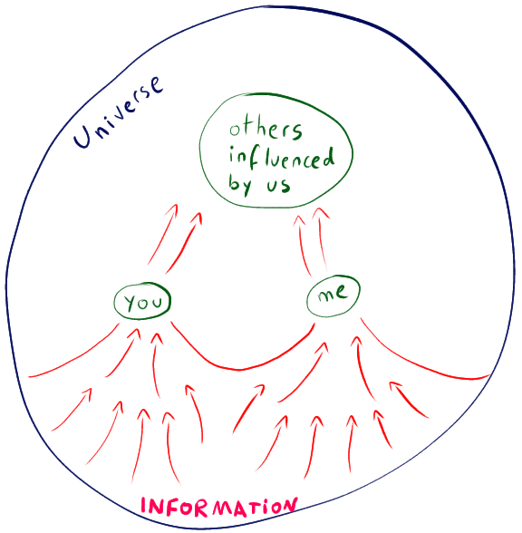

> Why are you acting so small? You are the Universe in ecstatic motion - _Rumi_

{width=100%}

The red arrows represent the "creating force": propagation of information that is adapted / conforming to (its) reality.

> Everyone must leave something behind when he dies, my grandfather said. A child or a book or a painting or a house or a wall built or a pair of shoes made. Or a garden planted. Something your hand touched some way so your soul has somewhere to go when you die, and when people look at that tree or that flower you planted, you're there.\
> It doesn't matter what you do, he said, so long as you change something from the way it was before you touched it into something that's like you after you take your hands away. The difference between the man who just cuts lawns and a real gardener is in the touching, he said. The lawn-cutter might just as well not have been there at all; the gardener will be there a lifetime. - from _Fahrenheit 451_ by _Ray Bradbury_
