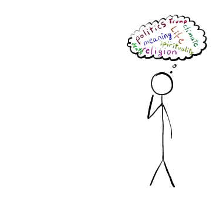
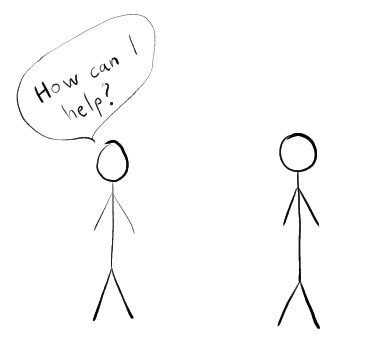
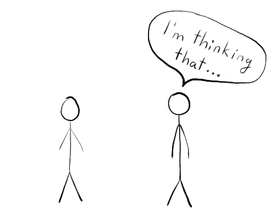
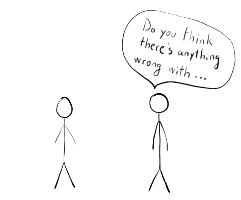
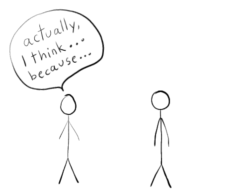

First, we need to think for ourselves.  This is in contrast with being told what to believe or think.

{width=100%}

Next, we must help others for they are humans, just like us.

{width=100%}

Next, we must openly say our thoughts.  If you keep hearing your own thoughts, that is internal thinking.  In contrast, writing, speaking, drawing are not internal.

{width=100%}

But we must also genuinely want to disprove ourselves.  This is a [cornerstone](https://en.wikipedia.org/wiki/Exclusion_of_the_null_hypothesis) of critical thought and is also why we need others to help us.

{width=100%}

Finally, we must say openly when we disagree and give our reasoning.  It is how we can figure out what is true.

{width=100%}

Or, as presented by someone else...

<iframe class="video" src="https://www.youtube-nocookie.com/embed/vyt-62JsZjw"
        frameborder="0"
        allow="accelerometer; autoplay; clipboard-write; encrypted-media; gyroscope; picture-in-picture"
        allowfullscreen></iframe>

 Do you disagree?  [Let me know](https://github.com/neduard/axiomofchoice/issues).
