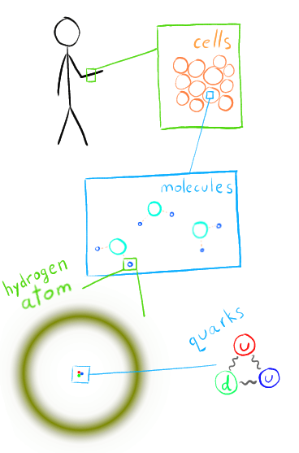
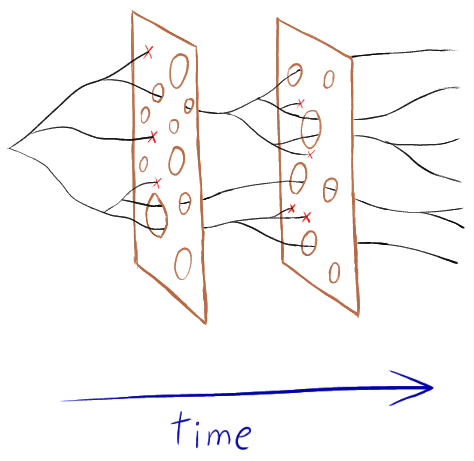
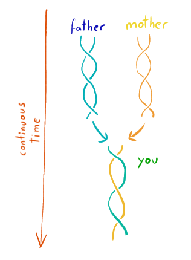

The last question my former mind-identified self asked was "but what am I?".
This [happened](https://www.reddit.com/r/Meditation/comments/gp31bq/how_can_i_help_myself/)
on Saturday 23rd of May 2020.

> The secret of life is to ‘die before you die’ and find that there is no death.\
> – _Eckhart Tolle_

# Material

We are made of atoms and mollecules.

{width=100%}

In other words, we are a very complex system of elementary particles that
interact together to form us.  How did that happen?

# Spirit

Natural selection can be seen as a filter.

{width=100%}

This is related to the idea of a "Great Filter":

<iframe width="560" height="315" src="https://www.youtube-nocookie.com/embed/UjtOGPJ0URM"
  frameborder="0"
  allow="accelerometer; autoplay; clipboard-write; encrypted-media; gyroscope; picture-in-picture"
  allowfullscreen></iframe>

So notice everything alive today is the endpoint of a continuous history of
reproduction that can be traced all the way back to the beginning of life on
Earth.

# Why is this happening?

- Existence of time
- [Entropy](https://youtu.be/vSgPRj207uE) always increasing and
- A quirk of chemistry that allows [self-replicating molecules](https://youtu.be/K1xnYFCZ9Yg)
to form (also [this](https://youtu.be/yTxZXkp-6sI) from same channel).

The result is the concept of **survival**.  Survival of individuals, but also of
populations and of species.  In short, survival of _information_.

# Adaptation

Adaptation happens once we combine variations (mutations) with selection.

Adaptations happen at different rates:

- slow: Genetic adaptations, stored as information in our DNA
- medium: cultural adaptation, transmitted initially as oral tradition, later
  replaced by books.
- fast: our mind's memory.  Can recal and adapt drastically within an
  individual's lifetime.

By the way, did you know sexual reproduction actually maximises [population
survivability](https://youtu.be/KP0WFbdHhJM) instead of individual survivability?

Also by the way, did you also know cooperation is a very good evolutionary
strategy which is why it shows up in individuals even among animals?
([video](https://youtu.be/A8Y0kCdYoug),
[book](https://www.goodreads.com/book/show/9725771-supercooperators))

Note therefore the conflict between survival of the individual (a.k.a. the _ego_)
vs survival of the whole species.  As individuals, the characteristics that
ensure our own survival (selfishness, narcissism, manipulation, lying, etc) are
not traits that benefit survival of the species.

# Those who don't remember history are bound to repeat it

We are the result of information which still hasn't "died" yet.  This
information has managed to be adapted to all the previous filters it
encountered.  It is stored in a number of locations:

- DNA
- cultural stories, myths, legends, fables, proverbs
- textbooks
- lessons transmited orally
- our neural conexions that make up our memory

**Observe therefore, how we are the physical manifestation of the spirit**

<iframe width="560" height="315"
  src="https://www.youtube-nocookie.com/embed/JQVmkDUkZT4"
  frameborder="0" allow="accelerometer; autoplay; clipboard-write; encrypted-media; gyroscope; picture-in-picture"
  allowfullscreen></iframe>
