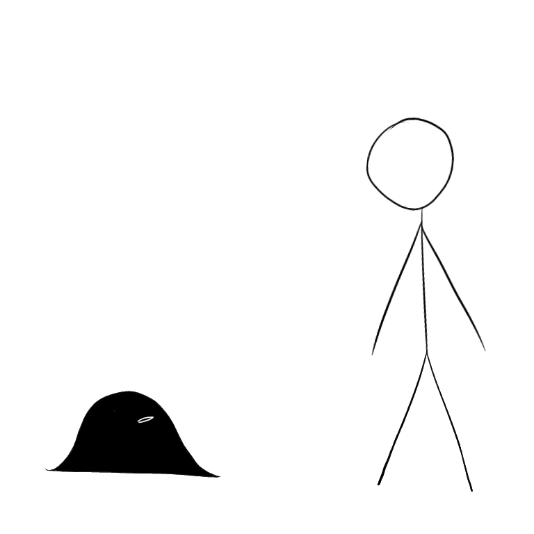
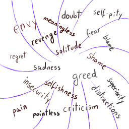
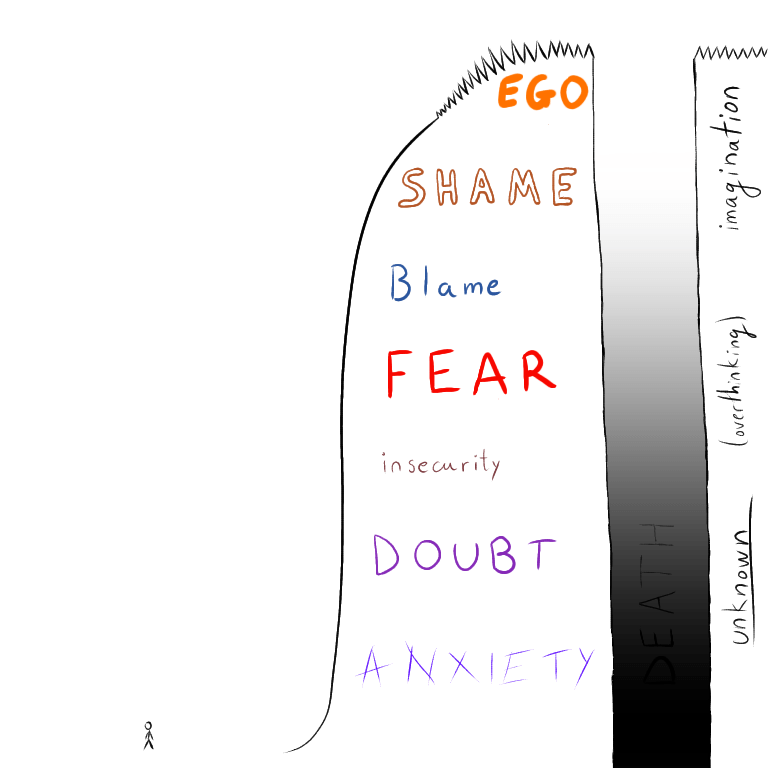
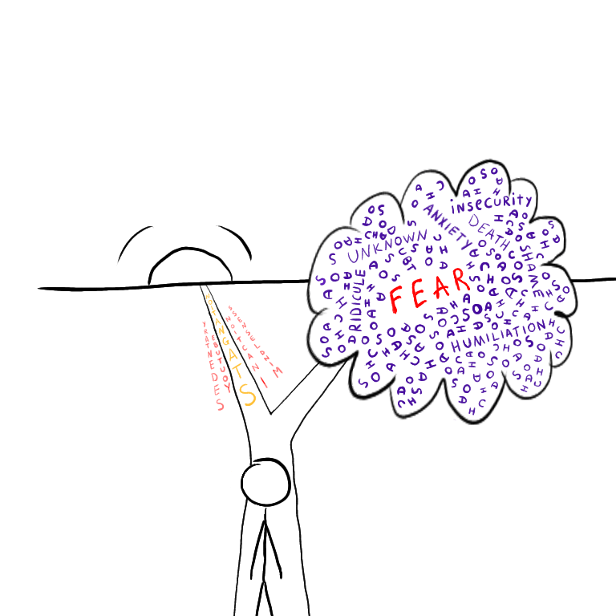

-----
title: Fear
-----

You will know the theory.  You will know Jim Carrey's
[speech](https://www.youtube-nocookie.com/embed/V80-gPkpH6M), Eckhart Tolle's
[books](https://en.wikipedia.org/wiki/Eckhart_Tolle#Books), John Vervaeke's
[series](https://www.youtube.com/playlist?list=PLND1JCRq8Vuh3f0P5qjrSdb5eC1ZfZwWJ),
Jordan Peterson's [book](https://en.wikipedia.org/wiki/12_Rules_for_Life) and
[lectures](https://www.youtube.com/watch?v=N21eVbQ7WEI), Sam Harris'
[book](https://samharris.org/books/waking-up/), [app](https://wakingup.com/) and
[podcast](https://samharris.org/podcast/), you will also know [The Midnight
Gospel](https://en.wikipedia.org/wiki/The_Midnight_Gospel), [Thich Nhat
Hahn](https://www.youtube.com/watch?v=dDW6FYdIoYE) and probably others.

But something in you will still be afraid.  Afraid of complete and total failure
and obliteration.  You'll remember the [Litany Against
Fear](https://dune.fandom.com/wiki/Litany_Against_Fear) from Dune:

> I must not fear.\
> Fear is the mind-killer.\
> Fear is the little-death that brings total obliteration.\
> I will face my fear.\
> I will permit it to pass over me and through me.\
> And when it has gone past I will turn the inner eye to see its path.\
> Where the fear has gone there will be nothing.\
> Only I will remain.

You'll also remember what Carrey's says in his speech:

> You will only ever have two choises: love or fear.  Choose love.

And you'll be loving, but at the same time you'll have a fear in you.  A dark
fear that will refuse to go away.  It won't be very big, it won't be
extremely terrifying, but it will be there and it no matter how many audiobooks,
articles or [r/spirituality](https://old.reddit.com/r/spirituality/) you consume
it will still be there.

{width=100%}

A little dark blob that follows you everywhere you go.  It doesn't even
do much.  It is not like a phobia to be overt and easy to identify.  No, just
simple thoughts.  Many... simple... thoughts...

{style="margin: auto; display:
block"}

Day after day, month after month, year after year you find that although
essentially free to do what you want, you are too afraid to actually start
anything big.  You fear big projects because you are terrified by big failure.
Small bets and small projects are OK, but anything bigger and you avoid.

You fear others' ridicule.  This, is probably a projection of your own [negative
thoughts](2021-05-02-thoughts-during-12-minute-meditation.html).  A reluctance
to make any large bet on your own conclusions seeps in and hence you become
stuck.  You are stuck between conventional / conservative / common wisdom of how
one should live their life and your own conclusions about what life is and how
to find meaning in it.  You become trapped between a mountain of fear and
stagnation.  To cross the mountain you will need to change.  You will need to
die.  You won't even know what is on the other side, except a different you.

{width=100%}

Or in other words:

{width=100%}
